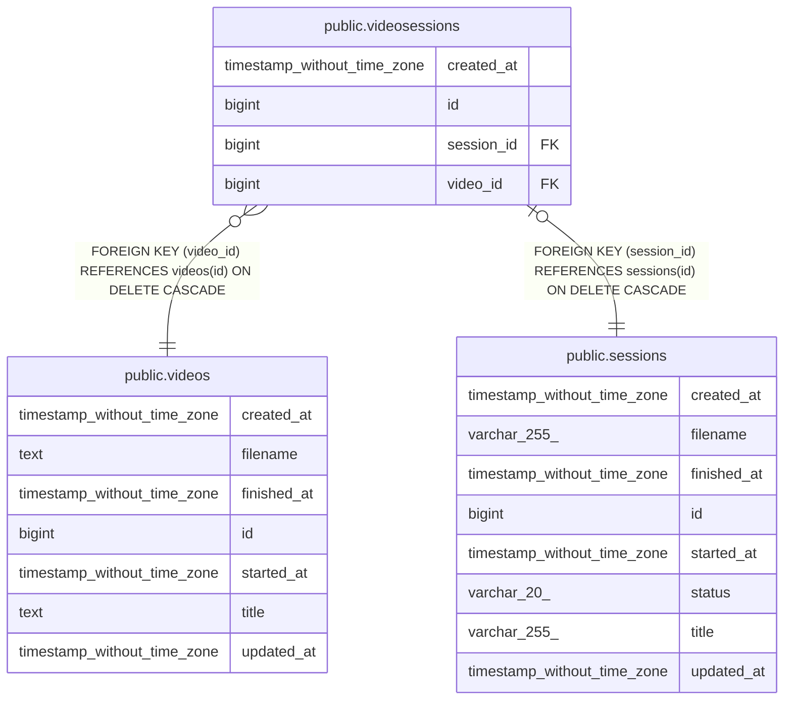

# tv

## Tables

| Name | Columns | Comment | Type |
| ---- | ------- | ------- | ---- |
| [public.sessions](public.sessions.md) | 8 | 録画セッション情報 | BASE TABLE |
| [public.videos](public.videos.md) | 7 | 動画情報 | BASE TABLE |
| [public.videosessions](public.videosessions.md) | 4 | 動画とセッションの関連テーブル | BASE TABLE |

## Relations

---

> Generated by [tbls](https://github.com/k1LoW/tbls)
