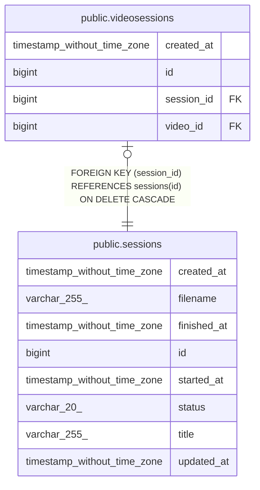

# public.sessions

## Description

録画セッション情報

## Columns

| Name | Type | Default | Nullable | Children | Parents | Comment |
| ---- | ---- | ------- | -------- | -------- | ------- | ------- |
| created_at | timestamp without time zone | now() | false |  |  |  |
| filename | varchar(255) |  | false |  |  | ファイル名 |
| finished_at | timestamp without time zone |  | true |  |  | 録画終了日時 |
| id | bigint | nextval('sessions_id_seq'::regclass) | false | [public.videosessions](public.videosessions.md) |  |  |
| started_at | timestamp without time zone | now() | false |  |  | 録画開始日時 |
| status | varchar(20) | 'recording'::character varying | false |  |  | セッション状態（recording, completed, failed） |
| title | varchar(255) |  | false |  |  | セッションタイトル |
| updated_at | timestamp without time zone | now() | false |  |  |  |

## Constraints

| Name | Type | Definition |
| ---- | ---- | ---------- |
| sessions_created_at_not_null | n | NOT NULL created_at |
| sessions_filename_key | UNIQUE | UNIQUE (filename) |
| sessions_filename_not_null | n | NOT NULL filename |
| sessions_id_not_null | n | NOT NULL id |
| sessions_pkey | PRIMARY KEY | PRIMARY KEY (id) |
| sessions_started_at_not_null | n | NOT NULL started_at |
| sessions_status_not_null | n | NOT NULL status |
| sessions_title_not_null | n | NOT NULL title |
| sessions_updated_at_not_null | n | NOT NULL updated_at |

## Indexes

| Name | Definition |
| ---- | ---------- |
| sessions_filename_key | CREATE UNIQUE INDEX sessions_filename_key ON public.sessions USING btree (filename) |
| sessions_pkey | CREATE UNIQUE INDEX sessions_pkey ON public.sessions USING btree (id) |

## Relations

---

> Generated by [tbls](https://github.com/k1LoW/tbls)
