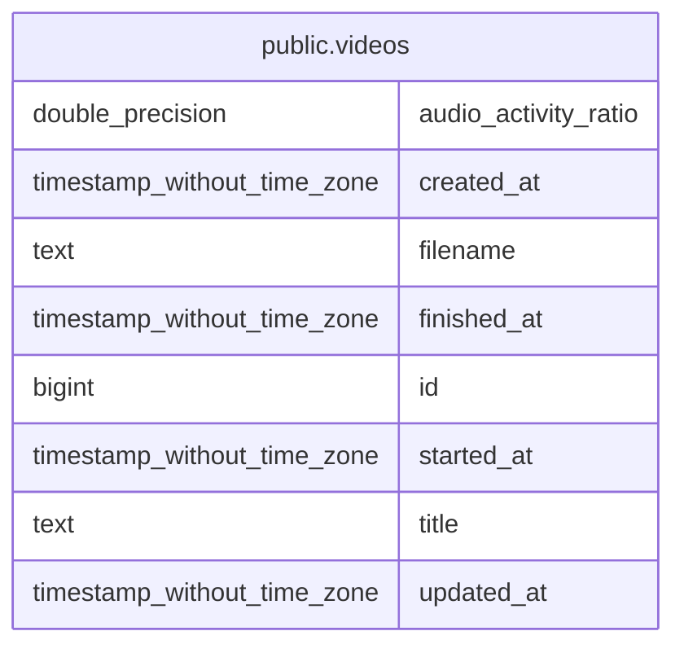

# public.videos

## Description

動画情報

## Columns

| Name | Type | Default | Nullable | Children | Parents | Comment |
| ---- | ---- | ------- | -------- | -------- | ------- | ------- |
| audio_activity_ratio | double precision | 0 | false |  |  | 音声の割合。品質評価用。低いと無音を示し、高いほうがよい |
| created_at | timestamp without time zone | CURRENT_TIMESTAMP | false |  |  |  |
| filename | text |  | true |  |  | ファイル名 |
| finished_at | timestamp without time zone |  | false |  |  | 録画終了日時(UTC) |
| id | bigint | nextval('videos_id_seq'::regclass) | false |  |  |  |
| started_at | timestamp without time zone |  | false |  |  | 録画開始日時(UTC) |
| title | text |  | false |  |  | 動画タイトル |
| updated_at | timestamp without time zone | CURRENT_TIMESTAMP | false |  |  |  |

## Constraints

| Name | Type | Definition |
| ---- | ---- | ---------- |
| videos_audio_activity_ratio_not_null | n | NOT NULL audio_activity_ratio |
| videos_created_at_not_null | n | NOT NULL created_at |
| videos_filename_key | UNIQUE | UNIQUE (filename) |
| videos_finished_at_not_null | n | NOT NULL finished_at |
| videos_id_not_null | n | NOT NULL id |
| videos_pkey | PRIMARY KEY | PRIMARY KEY (id) |
| videos_started_at_not_null | n | NOT NULL started_at |
| videos_title_not_null | n | NOT NULL title |
| videos_updated_at_not_null | n | NOT NULL updated_at |

## Indexes

| Name | Definition |
| ---- | ---------- |
| videos_filename_key | CREATE UNIQUE INDEX videos_filename_key ON public.videos USING btree (filename) |
| videos_pkey | CREATE UNIQUE INDEX videos_pkey ON public.videos USING btree (id) |

## Relations

---

> Generated by [tbls](https://github.com/k1LoW/tbls)
