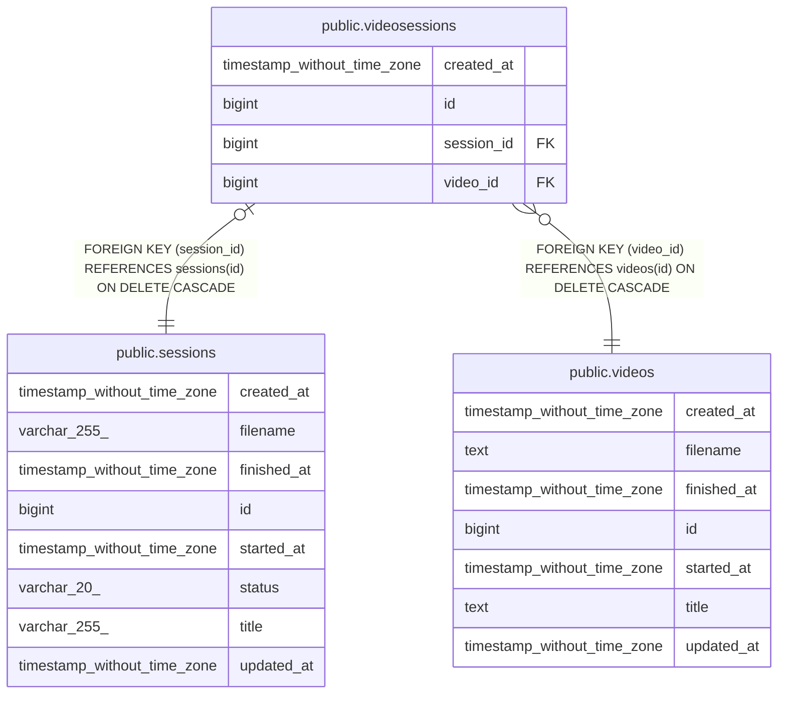

# public.videosessions

## Description

動画とセッションの関連テーブル

## Columns

| Name | Type | Default | Nullable | Children | Parents | Comment |
| ---- | ---- | ------- | -------- | -------- | ------- | ------- |
| created_at | timestamp without time zone | now() | false |  |  |  |
| id | bigint | nextval('videosessions_id_seq'::regclass) | false |  |  |  |
| session_id | bigint |  | false |  | [public.sessions](public.sessions.md) | セッションID |
| video_id | bigint |  | false |  | [public.videos](public.videos.md) | 動画ID |

## Constraints

| Name | Type | Definition |
| ---- | ---- | ---------- |
| videosessions_created_at_not_null | n | NOT NULL created_at |
| videosessions_id_not_null | n | NOT NULL id |
| videosessions_pkey | PRIMARY KEY | PRIMARY KEY (id) |
| videosessions_session_id_fkey | FOREIGN KEY | FOREIGN KEY (session_id) REFERENCES sessions(id) ON DELETE CASCADE |
| videosessions_session_id_key | UNIQUE | UNIQUE (session_id) |
| videosessions_session_id_not_null | n | NOT NULL session_id |
| videosessions_video_id_fkey | FOREIGN KEY | FOREIGN KEY (video_id) REFERENCES videos(id) ON DELETE CASCADE |
| videosessions_video_id_not_null | n | NOT NULL video_id |
| videosessions_video_id_session_id_key | UNIQUE | UNIQUE (video_id, session_id) |

## Indexes

| Name | Definition |
| ---- | ---------- |
| idx_videosessions_session_id | CREATE INDEX idx_videosessions_session_id ON public.videosessions USING btree (session_id) |
| idx_videosessions_video_id | CREATE INDEX idx_videosessions_video_id ON public.videosessions USING btree (video_id) |
| videosessions_pkey | CREATE UNIQUE INDEX videosessions_pkey ON public.videosessions USING btree (id) |
| videosessions_session_id_key | CREATE UNIQUE INDEX videosessions_session_id_key ON public.videosessions USING btree (session_id) |
| videosessions_video_id_session_id_key | CREATE UNIQUE INDEX videosessions_video_id_session_id_key ON public.videosessions USING btree (video_id, session_id) |

## Relations

---

> Generated by [tbls](https://github.com/k1LoW/tbls)
